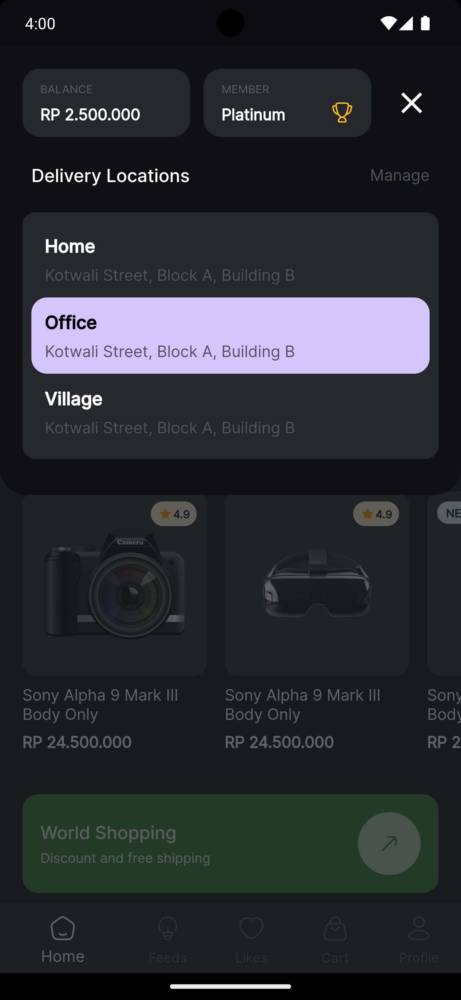

# DEMO : E-Commerce App

This is just a demo UI of an e-commerce app, made with Flutter!
The Ui was taken from a [Dribble sample](https://dribbble.com/shots/24375469-Electis-Shopping-for-Electronic-Goods-Mobile-App). Created by : [Dipa Products](https://dribbble.com/dipaproduct).

Here is some example of how the simple 2 page app looks (*taken from Pixel 7 Pro) -

|                                                                               |                                                                              |
| :---------------------------------------------------------------------------: | :--------------------------------------------------------------------------: |
|    |   |
|  |  |
|   |

